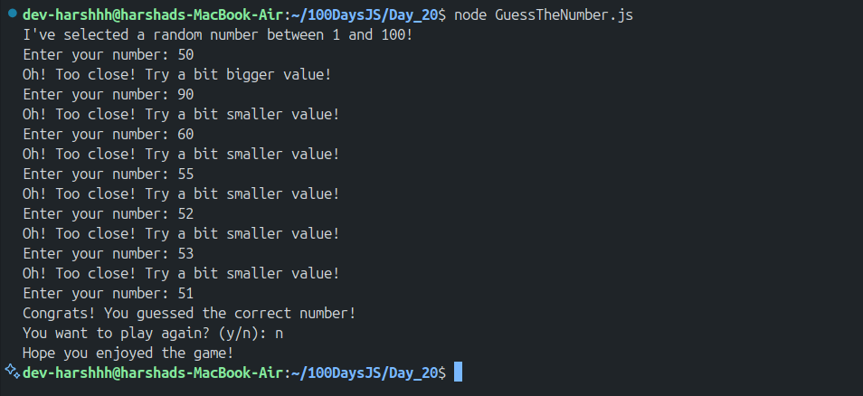

# Day 20

> Day 20 of 100 Days of Js - Learning and practicing JavaScript concepts. On Day 20, I build a simple guessing game using JavaScript CLI based on user input.

## Guess the Number Game
- A simple command-line guessing game where the user has to guess a randomly generated number between 1 and 100.
- The program provides feedback on whether the guess is too high, too low, or correct.
- The game continues until the user guesses the correct number.
- The user can choose to play again after each round.
- Implemented using Node.js for command-line interaction.

## [Guess The number](GuessTheNumber.js)

# screenshot


# How to run
1. Make sure you have Node.js installed on your machine.
2. Save the `GuessTheNumber.js` file to your local machine.
3. Open your terminal or command prompt.
4. Navigate to the directory where you saved the `GuessTheNumber.js` file.
5. Run the game using the command: 
   ```bash
   node GuessTheNumber.js
   ```
6. Follow the on-screen prompts to play the game.
7. Enjoy guessing the number!
8. After finishing a game, you can choose to play again or exit.

# Summary
On Day 20 of my 100 Days of JavaScript journey, I created a simple command-line guessing game using Node.js. The game generates a random number between 1 and 100, and the player has to guess the number with feedback provided on whether their guess is too high, too low, or correct. This project helped me practice handling user input, generating random numbers, and implementing loops in JavaScript. It was a fun and interactive way to reinforce my understanding of basic programming concepts while creating an enjoyable game experience.

# Support Me
If you find my work helpful and would like to support me, consider buying me a coffee! ☕ [Buy Me a Coffee](https://www.buymeacoffee.com/dev.harshhh)