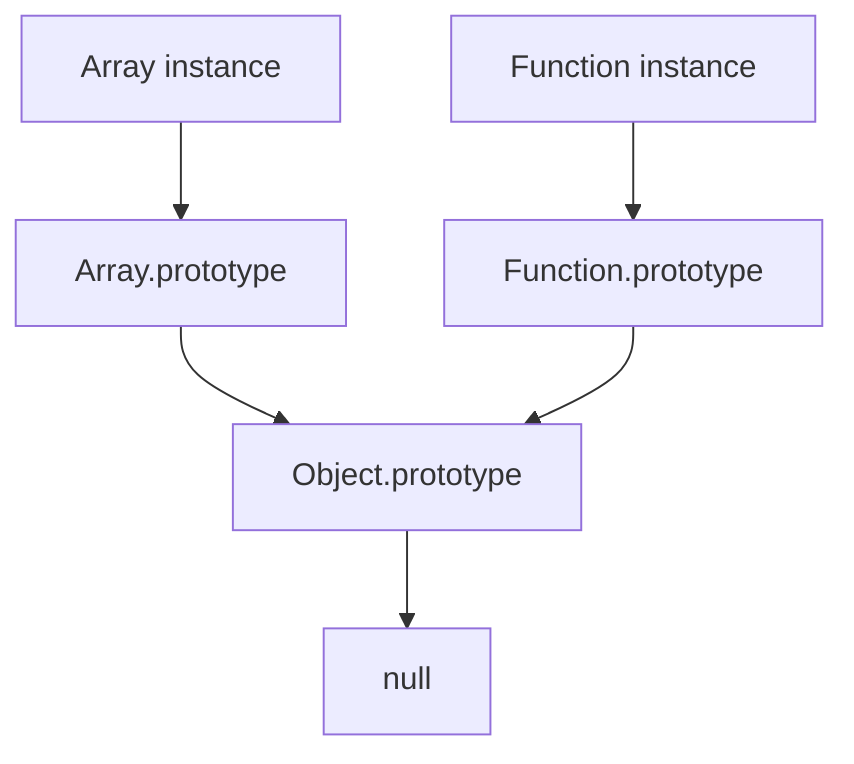

# Day 31 - Prototype
`On the day 31 of the 100 Days of Code challenge, I focused on learning about prototype in JS, which is a powerful feature that allows objects to inherit properties and methods from other objects.`
- it an quit theoratical topic, but understanding it is crucial for mastering JavaScript and its object-oriented programming capabilities.

---
> What is Prototype in JS?
- Prototype is a mechanism in JavaScript that allows objects to inherit properties and methods from other objects. Every JavaScript object has a prototype, which is another object from which it can inherit properties.
- When you try to access a property or method on an object, JavaScript first looks for that property or method on the object itself. If it doesn't find it there, it looks for it on the object's prototype, and so on, up the prototype chain until it finds the property or method or reaches the end of the chain.
- This allows for a powerful form of inheritance, where objects can share properties and methods without having to duplicate code.
- In JS, functions have a prototype property, which is an object that contains properties and methods that can be inherited by instances of that function.
- Example, If you create a function called `user`, you can add properties and methods to its prototype, which will be inherited by all instances of `user`.

### Example:
```javascript 
function user(name, age){
    this.name = name;
    this.age = age;
}
user.prototype.greet = function(){
    console.log(`Hello, My name is ${this.name} and I am ${this.age} years old.`);
}
const user1 = new user("Harshad", 19);
user1.greet(); // Output: Hello, My name is Harshad and I am 19 years old.
```
- This is an simple example of how prototype works inJS. By adding the `greet` method to the `user` prototype, all instances of `user` can access that method without having to define it on each instance.
---
> Practical Appication of Prototype:
- Prototypes are widely used in JS, frameworks and libraries to create reusable code and implement inheritance.
- Example, in popular libraries like React and Angular, prototypes are used to create components that can inherit properties and methods from other components.
### Examaple
```javascript
function superUser(name, role){
    this.name = name;
    this.role = role;
}
superUser.prototype.getDetails = function(){
    return `${this.name} is a ${this.role}`;
};
superUser.prototype.isAdmin = function(){
    return this.role.toLowerCase() === 'admin';
};

const user1 = new superUser('Harshad', 'Admin');
const User2 = new superUser('Wilson', 'Manager');

console.log(user1.getDetails());
console.log(User2.getDetails());
console.log(user1.isAdmin());
console.log(User2.isAdmin());
```
- Here, both `getDetails` and `isAdmin` methods are defined on the `superUser` prototype, allowing all instances of `superUser` to access these methods without duplicating code.
---
> Prototype Chain:
- The prototype chain is a series of linked objects that JS used to look up properties and methods.
- When you access a property or method on an object, JS first looks for that property or method on the object itself. It it doesn't find it there, it looks for it in the object's prototype, and so on, up the protorype chain until it finds the property or method or reaches the end of the chain.
- Every object in JS has a prototype, which is another object from which it can inherit properties and methods.
- The end of the prototype chain is `null`, which indicates that there are no more objects to look up.
---
> Prototype Chain Diagram:

- We can see that both `Array` and `Function` instances inherit from `Object.prototype`, which is the top-level prototype in JS.
---
> **prototype** vs **__ proto __**:
  1. `prototype` → A property only on functions, used to setup inheritance for instances created by that function.
  2. `__proto__` → A property on all objects, pointing to the prototype of the object it was created from.
- Difference Summary:

    | Aspect     | prototype                                                                                     | \_\_proto\_\_                                                                                   |
    |------------|----------------------------------------------------------------------------------------------|--------------------------------------------------------------------------------------------|
    | Definition | A property of **constructor functions** that defines the prototype for all instances created by that function. | An internal property of **all objects** that points to the prototype from which the object inherits. |
    | Usage      | Used to **define** and set up inheritance for instances created by a constructor function.   | Used to **access** or reference the prototype of an object.                                |
    | Location   | Exists **only on functions** (constructor functions).   
---
> Using class syntax with Prototype:
- We often use class syntax in modern JS, which is syntactical sugar over the prototype-based inheritance.
```javascript
class carStore{
    constructor(carName, carType){
        this.carName = carName;
        this.carType = carType;
    }
    getCarDetails(){
        return `Car Name: ${this.carName}, Car Type: ${this.carType}`;
    }
    sellCar(){
        return `${this.carName} has been sold!`
    }
}
const car1 = new carStore("BMW", "Sedan");
console.log(car1.getCarDetails());
console.log(car1.sellCar());
```
- The `getCarDetails` and `sellCar` methods are added to the `carStore` prototype, allowing all instances of `carStore`  to access these methods without duplicating code.
---

# Summary:
- # Key takeaways from learning about prototype in JS:
  1. Prototype is a mechanism in JS that allows objects to inherit properties and methods from other objects.
  2. Every JS object has a prototype, which is another obejct from which it can iherit properties.
  3. Prototypes are widely used in JS frameworks and libraries to create reusable code and implement inheritance.
  4. The prototype chain is a series of linked objects that JS uses to look up properties and methods.
  5. Understanding prototype is crucial for mastering JS and its object-oriented programming capabilities.
---
