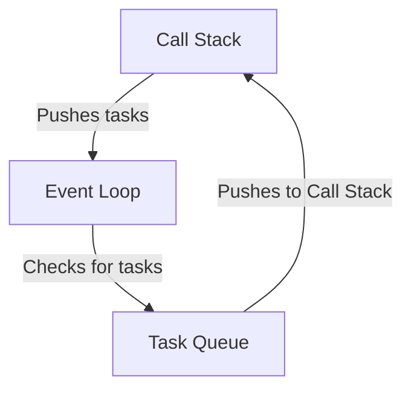

# Day 37 - Event Loop (Fundamentals)
> Event Loop
- The Event loop is a core concept in JS, tthat enables asynchronous programming by handling tasks efficiently.
- It allows non-blocking operations, meaning that long-running tasks (like network requests or timers) do not block the main thread.
- The event loop continuously checks the callstack and the task queue.


- When the call stack is empty, the event loop takes the first task from the task queue and pushes into the call stack for execution.
- This mechanism allows JS to perform non-blocking operations, making it suitable for web applications that require responsiveness.

```javascript
console.log('Start');
setTimeOut(() => {
    console.log('Timeout finished');
},2000);
console.log('End');
```
- `setTimeout` is an example of an asynchronous operation that uses the event loop.
- "Start" is logged first, then "End", and after 2 seconds, "Timeout finished" is logged.
---
> How Event Loop Works
1. **Call Stack**: JS has a Call Stack where function execution is managed in the **LIFO** (Last In, First Out) order.
2. **Web APIs**: This includes setTimeot, setInterval, fetch, DOM events, and other non-blocking operations.
3. **Callback queue (Task Queue)**: When an asynchronous function is completed, its callback is pushed to the Callback Queue.
4. **Microtask Queue**: This queue has higher priority than the Callback Queue and includes tasks like Promises and Multation Observers.
5. **Event Loop**: IT continuously checks the Call Stack and if it's empty, it first processes all tasks in the Microtask Queue before moving to the Callback Queue.


---
<g id="viewport-20251117131948022" class="svg-pan-zoom_viewport" transform="matrix(0.673763455476115,0,0,0.673763455476115,509.4340625719871,-49.96969437243557)" style="transform: matrix(0.673763, 0, 0, 0.673763, 509.434, -49.9697);"><style>#graph-5{font-family:"trebuchet ms",verdana,arial,sans-serif;font-size:16px;fill:#ccc;}@keyframes edge-animation-frame{from{stroke-dashoffset:0;}}@keyframes dash{to{stroke-dashoffset:0;}}#graph-5 .edge-animation-slow{stroke-dasharray:9,5!important;stroke-dashoffset:900;animation:dash 50s linear infinite;stroke-linecap:round;}#graph-5 .edge-animation-fast{stroke-dasharray:9,5!important;stroke-dashoffset:900;animation:dash 20s linear infinite;stroke-linecap:round;}#graph-5 .error-icon{fill:#a44141;}#graph-5 .error-text{fill:#ddd;stroke:#ddd;}#graph-5 .edge-thickness-normal{stroke-width:1px;}#graph-5 .edge-thickness-thick{stroke-width:3.5px;}#graph-5 .edge-pattern-solid{stroke-dasharray:0;}#graph-5 .edge-thickness-invisible{stroke-width:0;fill:none;}#graph-5 .edge-pattern-dashed{stroke-dasharray:3;}#graph-5 .edge-pattern-dotted{stroke-dasharray:2;}#graph-5 .marker{fill:lightgrey;stroke:lightgrey;}#graph-5 .marker.cross{stroke:lightgrey;}#graph-5 svg{font-family:"trebuchet ms",verdana,arial,sans-serif;font-size:16px;}#graph-5 p{margin:0;}#graph-5 .label{font-family:"trebuchet ms",verdana,arial,sans-serif;color:#ccc;}#graph-5 .cluster-label text{fill:#F9FFFE;}#graph-5 .cluster-label span{color:#F9FFFE;}#graph-5 .cluster-label span p{background-color:transparent;}#graph-5 .label text,#graph-5 span{fill:#ccc;color:#ccc;}#graph-5 .node rect,#graph-5 .node circle,#graph-5 .node ellipse,#graph-5 .node polygon,#graph-5 .node path{fill:#1f2020;stroke:#ccc;stroke-width:1px;}#graph-5 .rough-node .label text,#graph-5 .node .label text,#graph-5 .image-shape .label,#graph-5 .icon-shape .label{text-anchor:middle;}#graph-5 .node .katex path{fill:#000;stroke:#000;stroke-width:1px;}#graph-5 .rough-node .label,#graph-5 .node .label,#graph-5 .image-shape .label,#graph-5 .icon-shape .label{text-align:center;}#graph-5 .node.clickable{cursor:pointer;}#graph-5 .root .anchor path{fill:lightgrey!important;stroke-width:0;stroke:lightgrey;}#graph-5 .arrowheadPath{fill:lightgrey;}#graph-5 .edgePath .path{stroke:lightgrey;stroke-width:2.0px;}#graph-5 .flowchart-link{stroke:lightgrey;fill:none;}#graph-5 .edgeLabel{background-color:hsl(0, 0%, 34.4117647059%);text-align:center;}#graph-5 .edgeLabel p{background-color:hsl(0, 0%, 34.4117647059%);}#graph-5 .edgeLabel rect{opacity:0.5;background-color:hsl(0, 0%, 34.4117647059%);fill:hsl(0, 0%, 34.4117647059%);}#graph-5 .labelBkg{background-color:rgba(87.75, 87.75, 87.75, 0.5);}#graph-5 .cluster rect{fill:hsl(180, 1.5873015873%, 28.3529411765%);stroke:rgba(255, 255, 255, 0.25);stroke-width:1px;}#graph-5 .cluster text{fill:#F9FFFE;}#graph-5 .cluster span{color:#F9FFFE;}#graph-5 div.mermaidTooltip{position:absolute;text-align:center;max-width:200px;padding:2px;font-family:"trebuchet ms",verdana,arial,sans-serif;font-size:12px;background:hsl(20, 1.5873015873%, 12.3529411765%);border:1px solid rgba(255, 255, 255, 0.25);border-radius:2px;pointer-events:none;z-index:100;}#graph-5 .flowchartTitleText{text-anchor:middle;font-size:18px;fill:#ccc;}#graph-5 rect.text{fill:none;stroke-width:0;}#graph-5 .icon-shape,#graph-5 .image-shape{background-color:hsl(0, 0%, 34.4117647059%);text-align:center;}#graph-5 .icon-shape p,#graph-5 .image-shape p{background-color:hsl(0, 0%, 34.4117647059%);padding:2px;}#graph-5 .icon-shape rect,#graph-5 .image-shape rect{opacity:0.5;background-color:hsl(0, 0%, 34.4117647059%);fill:hsl(0, 0%, 34.4117647059%);}#graph-5 .label-icon{display:inline-block;height:1em;overflow:visible;vertical-align:-0.125em;}#graph-5 .node .label-icon path{fill:currentColor;stroke:revert;stroke-width:revert;}#graph-5 :root{--mermaid-font-family:"trebuchet ms",verdana,arial,sans-serif;}</style><g><marker id="graph-5_flowchart-v2-pointEnd" class="marker flowchart-v2" viewBox="0 0 10 10" refX="5" refY="5" markerUnits="userSpaceOnUse" markerWidth="8" markerHeight="8" orient="auto"><path d="M 0 0 L 10 5 L 0 10 z" class="arrowMarkerPath" style="stroke-width: 1; stroke-dasharray: 1, 0;"></path></marker><marker id="graph-5_flowchart-v2-pointStart" class="marker flowchart-v2" viewBox="0 0 10 10" refX="4.5" refY="5" markerUnits="userSpaceOnUse" markerWidth="8" markerHeight="8" orient="auto"><path d="M 0 5 L 10 10 L 10 0 z" class="arrowMarkerPath" style="stroke-width: 1; stroke-dasharray: 1, 0;"></path></marker><marker id="graph-5_flowchart-v2-circleEnd" class="marker flowchart-v2" viewBox="0 0 10 10" refX="11" refY="5" markerUnits="userSpaceOnUse" markerWidth="11" markerHeight="11" orient="auto"><circle cx="5" cy="5" r="5" class="arrowMarkerPath" style="stroke-width: 1; stroke-dasharray: 1, 0;"></circle></marker><marker id="graph-5_flowchart-v2-circleStart" class="marker flowchart-v2" viewBox="0 0 10 10" refX="-1" refY="5" markerUnits="userSpaceOnUse" markerWidth="11" markerHeight="11" orient="auto"><circle cx="5" cy="5" r="5" class="arrowMarkerPath" style="stroke-width: 1; stroke-dasharray: 1, 0;"></circle></marker><marker id="graph-5_flowchart-v2-crossEnd" class="marker cross flowchart-v2" viewBox="0 0 11 11" refX="12" refY="5.2" markerUnits="userSpaceOnUse" markerWidth="11" markerHeight="11" orient="auto"><path d="M 1,1 l 9,9 M 10,1 l -9,9" class="arrowMarkerPath" style="stroke-width: 2; stroke-dasharray: 1, 0;"></path></marker><marker id="graph-5_flowchart-v2-crossStart" class="marker cross flowchart-v2" viewBox="0 0 11 11" refX="-1" refY="5.2" markerUnits="userSpaceOnUse" markerWidth="11" markerHeight="11" orient="auto"><path d="M 1,1 l 9,9 M 10,1 l -9,9" class="arrowMarkerPath" style="stroke-width: 2; stroke-dasharray: 1, 0;"></path></marker></g><g class="subgraphs"><g class="subgraph"><g class="cluster" id="PRIORITYQ" data-look="classic"><rect style="" x="8" y="776.453125" width="208" height="297"></rect><g class="cluster-label" transform="translate(12, 776.453125)"><foreignObject width="200" height="48"><div xmlns="http://www.w3.org/1999/xhtml" style="display: table; white-space: break-spaces; line-height: 1.5; max-width: 200px; text-align: center; width: 200px;"><span class="nodeLabel"><p>Priority Queue (Highest Priority)</p></span></div></foreignObject></g></g></g><g class="subgraph"><g class="cluster" id="CALLBACKQ" data-look="classic"><rect style="" x="270.7604166666667" y="776.453125" width="208" height="213"></rect><g class="cluster-label" transform="translate(274.7604166666667, 776.453125)"><foreignObject width="200" height="48"><div xmlns="http://www.w3.org/1999/xhtml" style="display: table; white-space: break-spaces; line-height: 1.5; max-width: 200px; text-align: center; width: 200px;"><span class="nodeLabel"><p>Callback Queue (Lowest Priority)</p></span></div></foreignObject></g></g></g><g class="subgraph"><g class="cluster" id="WEBAPIS" data-look="classic"><rect style="" x="233.16927083333337" y="450.953125" width="162.546875" height="273"></rect><g class="cluster-label" transform="translate(279.45833333333337, 450.953125)"><foreignObject width="69.96875" height="24"><div xmlns="http://www.w3.org/1999/xhtml" style="display: table-cell; white-space: nowrap; line-height: 1.5; max-width: 200px; text-align: center;"><span class="nodeLabel"><p>Web APIs</p></span></div></foreignObject></g></g></g><g class="subgraph"><g class="cluster" id="CALLSTACK" data-look="classic"><rect style="" x="91.4921875" y="142.953125" width="190.609375" height="273"></rect><g class="cluster-label" transform="translate(150.78125, 142.953125)"><foreignObject width="72.03125" height="24"><div xmlns="http://www.w3.org/1999/xhtml" style="display: table-cell; white-space: nowrap; line-height: 1.5; max-width: 200px; text-align: center;"><span class="nodeLabel"><p>Call Stack</p></span></div></foreignObject></g></g></g></g><g class="nodes"><g class="node default" id="flowchart-P1-10" transform="translate(112, 866.453125)"><rect class="basic label-container" style="" x="-66.015625" y="-27" width="132.03125" height="54"></rect><g class="label" style="" transform="translate(-36.015625, -12)"><rect></rect><foreignObject width="72.03125" height="24"><div xmlns="http://www.w3.org/1999/xhtml" style="display: table-cell; white-space: nowrap; line-height: 1.5; max-width: 200px; text-align: center;"><span class="nodeLabel"><p>Promise 1</p></span></div></foreignObject></g></g><g class="node default" id="flowchart-P2-11" transform="translate(112, 950.453125)"><rect class="basic label-container" style="" x="-66.015625" y="-27" width="132.03125" height="54"></rect><g class="label" style="" transform="translate(-36.015625, -12)"><rect></rect><foreignObject width="72.03125" height="24"><div xmlns="http://www.w3.org/1999/xhtml" style="display: table-cell; white-space: nowrap; line-height: 1.5; max-width: 200px; text-align: center;"><span class="nodeLabel"><p>Promise 2</p></span></div></foreignObject></g></g><g class="node default" id="flowchart-P3-12" transform="translate(112, 1034.453125)"><rect class="basic label-container" style="" x="-66.015625" y="-27" width="132.03125" height="54"></rect><g class="label" style="" transform="translate(-36.015625, -12)"><rect></rect><foreignObject width="72.03125" height="24"><div xmlns="http://www.w3.org/1999/xhtml" style="display: table-cell; white-space: nowrap; line-height: 1.5; max-width: 200px; text-align: center;"><span class="nodeLabel"><p>Promise 3</p></span></div></foreignObject></g></g><g class="node default" id="flowchart-C1-8" transform="translate(374.7604166666667, 866.453125)"><rect class="basic label-container" style="" x="-54.453125" y="-27" width="108.90625" height="54"></rect><g class="label" style="" transform="translate(-24.453125, -12)"><rect></rect><foreignObject width="48.90625" height="24"><div xmlns="http://www.w3.org/1999/xhtml" style="display: table-cell; white-space: nowrap; line-height: 1.5; max-width: 200px; text-align: center;"><span class="nodeLabel"><p>onclick</p></span></div></foreignObject></g></g><g class="node default" id="flowchart-C2-9" transform="translate(374.7604166666667, 950.453125)"><rect class="basic label-container" style="" x="-54.453125" y="-27" width="108.90625" height="54"></rect><g class="label" style="" transform="translate(-24.453125, -12)"><rect></rect><foreignObject width="48.90625" height="24"><div xmlns="http://www.w3.org/1999/xhtml" style="display: table-cell; white-space: nowrap; line-height: 1.5; max-width: 200px; text-align: center;"><span class="nodeLabel"><p>onclick</p></span></div></foreignObject></g></g><g class="node default" id="flowchart-W1-5" transform="translate(314.44270833333337, 684.953125)"><rect class="basic label-container" style="" x="-69.2734375" y="-27" width="138.546875" height="54"></rect><g class="label" style="" transform="translate(-39.2734375, -12)"><rect></rect><foreignObject width="78.546875" height="24"><div xmlns="http://www.w3.org/1999/xhtml" style="display: table-cell; white-space: nowrap; line-height: 1.5; max-width: 200px; text-align: center;"><span class="nodeLabel"><p>setTimeout</p></span></div></foreignObject></g></g><g class="node default" id="flowchart-W2-6" transform="translate(293.83333333333337, 600.953125)"><rect class="basic label-container" style="" x="-48.6640625" y="-27" width="97.328125" height="54"></rect><g class="label" style="" transform="translate(-18.6640625, -12)"><rect></rect><foreignObject width="37.328125" height="24"><div xmlns="http://www.w3.org/1999/xhtml" style="display: table-cell; white-space: nowrap; line-height: 1.5; max-width: 200px; text-align: center;"><span class="nodeLabel"><p>DOM</p></span></div></foreignObject></g></g><g class="node default" id="flowchart-W3-7" transform="translate(292.51302083333337, 516.953125)"><rect class="basic label-container" style="" x="-47.34375" y="-27" width="94.6875" height="54"></rect><g class="label" style="" transform="translate(-17.34375, -12)"><rect></rect><foreignObject width="34.6875" height="24"><div xmlns="http://www.w3.org/1999/xhtml" style="display: table-cell; white-space: nowrap; line-height: 1.5; max-width: 200px; text-align: center;"><span class="nodeLabel"><p>fetch</p></span></div></foreignObject></g></g><g class="node default" id="flowchart-CS1-0" transform="translate(186.796875, 376.953125)"><rect class="basic label-container" style="" x="-83.3046875" y="-27" width="166.609375" height="54"></rect><g class="label" style="" transform="translate(-53.3046875, -12)"><rect></rect><foreignObject width="106.609375" height="24"><div xmlns="http://www.w3.org/1999/xhtml" style="display: table-cell; white-space: nowrap; line-height: 1.5; max-width: 200px; text-align: center;"><span class="nodeLabel"><p>console.log('a')</p></span></div></foreignObject></g></g><g class="node default" id="flowchart-CS2-2" transform="translate(168.5625, 292.953125)"><rect class="basic label-container" style="" x="-65.0703125" y="-27" width="130.140625" height="54"></rect><g class="label" style="" transform="translate(-35.0703125, -12)"><rect></rect><foreignObject width="70.140625" height="24"><div xmlns="http://www.w3.org/1999/xhtml" style="display: table-cell; white-space: nowrap; line-height: 1.5; max-width: 200px; text-align: center;"><span class="nodeLabel"><p>logger('a')</p></span></div></foreignObject></g></g><g class="node default" id="flowchart-CS3-4" transform="translate(156.1640625, 208.953125)"><rect class="basic label-container" style="" x="-52.671875" y="-27" width="105.34375" height="54"></rect><g class="label" style="" transform="translate(-22.671875, -12)"><rect></rect><foreignObject width="45.34375" height="24"><div xmlns="http://www.w3.org/1999/xhtml" style="display: table-cell; white-space: nowrap; line-height: 1.5; max-width: 200px; text-align: center;"><span class="nodeLabel"><p>main()</p></span></div></foreignObject></g></g><g class="node default" id="flowchart-EL-20" transform="translate(186.796875, 59.9765625)"><circle class="basic label-container" style="" r="47.9765625" cx="0" cy="0"></circle><g class="label" style="" transform="translate(-40.4765625, -12)"><rect></rect><foreignObject width="80.953125" height="24"><div xmlns="http://www.w3.org/1999/xhtml" style="display: table-cell; white-space: nowrap; line-height: 1.5; max-width: 200px; text-align: center;"><span class="nodeLabel"><p>Event Loop</p></span></div></foreignObject></g></g></g><g class="edges edgePaths"><path d="M155.029,415.953L155.029,469.37C155.029,522.786,155.029,629.62,154.667,683.508C154.305,737.396,153.581,738.339,152.748,739.172C151.914,740.005,150.971,740.729,144.995,741.091C139.019,741.453,128.01,741.453,122.033,741.815C116.057,742.177,115.114,742.901,114.281,743.734C113.448,744.568,112.724,745.51,112.362,750.315C112,755.12,112,763.786,112,768.12L112,772.453" id="L_CALLSTACK_PRIORITYQ_0_0" class="edge-thickness-normal edge-pattern-solid edge-thickness-normal edge-pattern-solid flowchart-link" style=";" data-edge="true" data-et="edge" data-id="L_CALLSTACK_PRIORITYQ_0_0" data-points="W3sieCI6MTU1LjAyODY0NTgzMzMzMzM0LCJ5Ijo0MTUuOTUzMTI1fSx7IngiOjE1NS4wMjg2NDU4MzMzMzMzNCwieSI6NzQxLjQ1MzEyNX0seyJ4IjoxMTIsInkiOjc0MS40NTMxMjV9LHsieCI6MTEyLCJ5Ijo3NzYuNDUzMTI1fV0=" marker-end="url(#graph-5_flowchart-v2-pointEnd)"></path><path d="M218.565,415.953L218.565,418.036C218.565,420.12,218.565,424.286,218.927,426.841C219.289,429.396,220.013,430.339,220.846,431.172C221.679,432.005,222.622,432.729,263.786,433.091C304.949,433.453,386.332,433.453,427.496,433.815C468.659,434.177,469.602,434.901,470.435,435.734C471.268,436.568,471.992,437.51,472.354,487.648C472.716,537.786,472.716,637.12,472.354,687.258C471.992,737.396,471.268,738.339,470.435,739.172C469.602,740.005,468.659,740.729,453.528,741.091C438.398,741.453,409.079,741.453,393.948,741.815C378.818,742.177,377.875,742.901,377.041,743.734C376.208,744.568,375.484,745.51,375.122,750.315C374.76,755.12,374.76,763.786,374.76,768.12L374.76,772.453" id="L_CALLSTACK_CALLBACKQ_0_0" class="edge-thickness-normal edge-pattern-solid edge-thickness-normal edge-pattern-solid flowchart-link" style=";" data-edge="true" data-et="edge" data-id="L_CALLSTACK_CALLBACKQ_0_0" data-points="W3sieCI6MjE4LjU2NTEwNDE2NjY2NjY5LCJ5Ijo0MTUuOTUzMTI1fSx7IngiOjIxOC41NjUxMDQxNjY2NjY2OSwieSI6NDMzLjQ1MzEyNX0seyJ4Ijo0NzIuNzE2MTQ1ODMzMzMzMzcsInkiOjQzMy40NTMxMjV9LHsieCI6NDcyLjcxNjE0NTgzMzMzMzM3LCJ5Ijo3NDEuNDUzMTI1fSx7IngiOjM3NC43NjA0MTY2NjY2NjY3LCJ5Ijo3NDEuNDUzMTI1fSx7IngiOjM3NC43NjA0MTY2NjY2NjY3LCJ5Ijo3NzYuNDUzMTI1fV0=" marker-end="url(#graph-5_flowchart-v2-pointEnd)"></path><path d="M341.534,723.953L341.534,772.453" id="L_WEBAPIS_CALLBACKQ_0_0" class="edge-thickness-normal edge-pattern-solid edge-thickness-normal edge-pattern-solid flowchart-link" style=";" data-edge="true" data-et="edge" data-id="L_WEBAPIS_CALLBACKQ_0_0" data-points="W3sieCI6MzQxLjUzMzg1NDE2NjY2NjcsInkiOjcyMy45NTMxMjV9LHsieCI6MzQxLjUzMzg1NDE2NjY2NjcsInkiOjc3Ni40NTMxMjV9XQ==" marker-end="url(#graph-5_flowchart-v2-pointEnd)"></path><path d="M287.352,723.953L287.352,728.953C287.352,733.953,287.352,743.953,286.99,749.425C286.628,754.896,285.904,755.839,285.071,756.672C284.237,757.505,283.294,758.229,261.766,758.591C240.237,758.953,198.122,758.953,176.594,759.315C155.065,759.677,154.122,760.401,153.289,761.234C152.456,762.068,151.732,763.01,151.37,764.898C151.008,766.786,151.008,769.62,151.008,771.036L151.008,772.453" id="L_WEBAPIS_PRIORITYQ_0_0" class="edge-thickness-normal edge-pattern-solid edge-thickness-normal edge-pattern-solid flowchart-link" style=";" data-edge="true" data-et="edge" data-id="L_WEBAPIS_PRIORITYQ_0_0" data-points="W3sieCI6Mjg3LjM1MTU2MjUsInkiOjcyMy45NTMxMjV9LHsieCI6Mjg3LjM1MTU2MjUsInkiOjc1OC45NTMxMjV9LHsieCI6MTUxLjAwNzgxMjUsInkiOjc1OC45NTMxMjV9LHsieCI6MTUxLjAwNzgxMjUsInkiOjc3Ni40NTMxMjV9XQ==" marker-end="url(#graph-5_flowchart-v2-pointEnd)"></path><path d="M186.797,107.953L186.797,138.953" id="L_EL_CALLSTACK_0_0" class="edge-thickness-normal edge-pattern-solid edge-thickness-normal edge-pattern-solid flowchart-link" style=";" data-edge="true" data-et="edge" data-id="L_EL_CALLSTACK_0_0" data-points="W3sieCI6MTg2Ljc5Njg3NSwieSI6MTA3Ljk1MzEyNX0seyJ4IjoxODYuNzk2ODc1LCJ5IjoxNDIuOTUzMTI1fV0=" marker-end="url(#graph-5_flowchart-v2-pointEnd)"></path><path d="M162.809,107.953L162.809,110.036C162.809,112.12,162.809,116.286,162.447,118.841C162.085,121.396,161.361,122.339,160.528,123.172C159.694,124.005,158.751,124.729,144.977,125.091C131.203,125.453,104.598,125.453,90.824,125.815C77.049,126.177,76.107,126.901,75.273,127.734C74.44,128.568,73.716,129.51,73.354,154.815C72.992,180.12,72.992,229.786,72.992,305.953C72.992,382.12,72.992,484.786,72.992,566.953C72.992,649.12,72.992,710.786,72.992,741.62L72.992,772.453" id="L_EL_PRIORITYQ_0_0" class="edge-thickness-normal edge-pattern-solid edge-thickness-normal edge-pattern-solid flowchart-link" style=";" data-edge="true" data-et="edge" data-id="L_EL_PRIORITYQ_0_0" data-points="W3sieCI6MTYyLjgwODU5Mzc1LCJ5IjoxMDcuOTUzMTI1fSx7IngiOjE2Mi44MDg1OTM3NSwieSI6MTI1LjQ1MzEyNX0seyJ4Ijo3Mi45OTIxODc1LCJ5IjoxMjUuNDUzMTI1fSx7IngiOjcyLjk5MjE4NzUsInkiOjI3OS40NTMxMjV9LHsieCI6NzIuOTkyMTg3NSwieSI6NTg3LjQ1MzEyNX0seyJ4Ijo3Mi45OTIxODc1LCJ5Ijo3NzYuNDUzMTI1fV0=" marker-end="url(#graph-5_flowchart-v2-pointEnd)"></path><path d="M210.785,107.953L210.785,110.036C210.785,112.12,210.785,116.286,211.147,118.841C211.509,121.396,212.233,122.339,213.066,123.172C213.9,124.005,214.842,124.729,267.149,125.091C319.455,125.453,423.125,125.453,475.431,125.815C527.737,126.177,528.68,126.901,529.513,127.734C530.347,128.568,531.07,129.51,531.432,154.815C531.794,180.12,531.794,229.786,531.794,305.953C531.794,382.12,531.794,484.786,531.794,563.87C531.794,642.953,531.794,698.453,531.432,726.675C531.07,754.896,530.347,755.839,529.513,756.672C528.68,757.505,527.737,758.229,508.298,758.591C488.859,758.953,450.923,758.953,431.483,759.315C412.044,759.677,411.101,760.401,410.268,761.234C409.435,762.068,408.711,763.01,408.349,764.898C407.987,766.786,407.987,769.62,407.987,771.036L407.987,772.453" id="L_EL_CALLBACKQ_0_0" class="edge-thickness-normal edge-pattern-solid edge-thickness-normal edge-pattern-solid flowchart-link" style=";" data-edge="true" data-et="edge" data-id="L_EL_CALLBACKQ_0_0" data-points="W3sieCI6MjEwLjc4NTE1NjI1LCJ5IjoxMDcuOTUzMTI1fSx7IngiOjIxMC43ODUxNTYyNSwieSI6MTI1LjQ1MzEyNX0seyJ4Ijo1MzEuNzk0MjcwODMzMzMzNCwieSI6MTI1LjQ1MzEyNX0seyJ4Ijo1MzEuNzk0MjcwODMzMzMzNCwieSI6Mjc5LjQ1MzEyNX0seyJ4Ijo1MzEuNzk0MjcwODMzMzMzNCwieSI6NTg3LjQ1MzEyNX0seyJ4Ijo1MzEuNzk0MjcwODMzMzMzNCwieSI6NzU4Ljk1MzEyNX0seyJ4Ijo0MDcuOTg2OTc5MTY2NjY2NywieSI6NzU4Ljk1MzEyNX0seyJ4Ijo0MDcuOTg2OTc5MTY2NjY2NywieSI6Nzc2LjQ1MzEyNX1d" marker-end="url(#graph-5_flowchart-v2-pointEnd)"></path></g><g class="edgeLabels"><g class="edgeLabel" transform="translate(154.59895833333334, 587.453125)"><g class="label" data-id="L_CALLSTACK_PRIORITYQ_0_0" transform="translate(-43.5703125, -12)"><foreignObject width="87.140625" height="24"><div xmlns="http://www.w3.org/1999/xhtml" class="labelBkg" style="display: table-cell; white-space: nowrap; line-height: 1.5; max-width: 200px; text-align: center;"><span class="edgeLabel"><p>High Priority</p></span></div></foreignObject></g></g><g class="edgeLabel" transform="translate(472.50520833333337, 587.453125)"><g class="label" data-id="L_CALLSTACK_CALLBACKQ_0_0" transform="translate(-41.7890625, -12)"><foreignObject width="83.578125" height="24"><div xmlns="http://www.w3.org/1999/xhtml" class="labelBkg" style="display: table-cell; white-space: nowrap; line-height: 1.5; max-width: 200px; text-align: center;"><span class="edgeLabel"><p>Low Priority</p></span></div></foreignObject></g></g><g class="edgeLabel"><g class="label" data-id="L_WEBAPIS_CALLBACKQ_0_0" transform="translate(0, 0)"><foreignObject width="0" height="0"><div xmlns="http://www.w3.org/1999/xhtml" class="labelBkg" style="display: table-cell; white-space: nowrap; line-height: 1.5; max-width: 200px; text-align: center;"><span class="edgeLabel"></span></div></foreignObject></g></g><g class="edgeLabel"><g class="label" data-id="L_WEBAPIS_PRIORITYQ_0_0" transform="translate(0, 0)"><foreignObject width="0" height="0"><div xmlns="http://www.w3.org/1999/xhtml" class="labelBkg" style="display: table-cell; white-space: nowrap; line-height: 1.5; max-width: 200px; text-align: center;"><span class="edgeLabel"></span></div></foreignObject></g></g><g class="edgeLabel"><g class="label" data-id="L_EL_CALLSTACK_0_0" transform="translate(0, 0)"><foreignObject width="0" height="0"><div xmlns="http://www.w3.org/1999/xhtml" class="labelBkg" style="display: table-cell; white-space: nowrap; line-height: 1.5; max-width: 200px; text-align: center;"><span class="edgeLabel"></span></div></foreignObject></g></g><g class="edgeLabel"><g class="label" data-id="L_EL_PRIORITYQ_0_0" transform="translate(0, 0)"><foreignObject width="0" height="0"><div xmlns="http://www.w3.org/1999/xhtml" class="labelBkg" style="display: table-cell; white-space: nowrap; line-height: 1.5; max-width: 200px; text-align: center;"><span class="edgeLabel"></span></div></foreignObject></g></g><g class="edgeLabel"><g class="label" data-id="L_EL_CALLBACKQ_0_0" transform="translate(0, 0)"><foreignObject width="0" height="0"><div xmlns="http://www.w3.org/1999/xhtml" class="labelBkg" style="display: table-cell; white-space: nowrap; line-height: 1.5; max-width: 200px; text-align: center;"><span class="edgeLabel"></span></div></foreignObject></g></g></g></g>