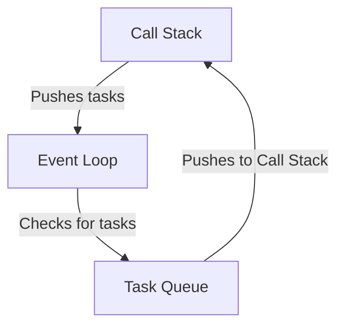

# Day 37 - Event Loop (Fundamentals)
### Topic covered:
---
### Event Loop
> Event Loop
- The Event loop is a core concept in JS, tthat enables asynchronous programming by handling tasks efficiently.
- It allows non-blocking operations, meaning that long-running tasks (like network requests or timers) do not block the main thread.
- The event loop continuously checks the callstack and the task queue.


- When the call stack is empty, the event loop takes the first task from the task queue and pushes into the call stack for execution.
- This mechanism allows JS to perform non-blocking operations, making it suitable for web applications that require responsiveness.

```javascript
console.log('Start');
setTimeout(() => {
    console.log('Timeout finished');
},2000);
console.log('End');
```
- `setTimeout` is an example of an asynchronous operation that uses the event loop.
- "Start" is logged first, then "End", and after 2 seconds, "Timeout finished" is logged.
---

> How Event Loop Works
1. **Call Stack**: JS has a Call Stack where function execution is managed in the **LIFO** (Last In, First Out) order.
2. **Web APIs**: This includes setTimeout, setInterval, fetch, DOM events, and other non-blocking operations.
3. **Callback queue (Task Queue)**: When an asynchronous function is completed, its callback is pushed to the Callback Queue.
4. **Microtask Queue (Job Queue)**: This queue has higher priority than the Callback Queue and includes tasks like Promises and Mutation Observers.
5. **Event Loop**: It continuously checks the Call Stack and if it's empty, it first processes all tasks in the Microtask Queue before moving to the Callback Queue.


---
> Phase of Event Loop
1. **Timers Phase**: Executes callbacks scheduled by `setTimeout` and `setInterval`.
2. **I/O Callbacks Phase**: Executes callback for I/O operations like network requests.
3. **Prepare Phase**: Internal phase used by `Node.js`.
4. **Poll Phase**: Retrieves new I/O events and executes their callbacks.
5. **Check Phase**: Executes callbacks scheduled by `setImmediate`.
6. **Close Callbacks Phase**: Executes close event callbacks like `socket.on('close', ...)`.
7. **Microtasks Execution**: After each phase, the event loops checks the Microtask Queue and executes all tasks in it before moving to the next phase.

```javascript
console.log('Start');
setTimeout(() => {
    console.log('Timeout finished');
}, 0);
Promise.resolve().then(() => {
    console.log('Promise resolved');
})
console.log('End');
```
- "Start" is logged first, then "End".
- The Promise callback is executed next because Microtasks have higher priority than the callback queue.
- Finally, "Timeout finished" is logged.
---
Here’s a polished and corrected version of what you wrote — clearer, more accurate, and with no grammar or spelling issues:

---

> **Web APIs vs Node.js APIs**

* **Web APIs** are provided by the **browser environment**, while **Node.js APIs** are provided by the **Node.js runtime (built on top of libuv)**.

* Both environments support **asynchronous operations**, but the **APIs they expose are different**, and the **internal implementations** also vary.

- **Browser Examples:**
  - `fetch`
  - `setTimeout`
  - `DOM events`
  - `localStorage`
  - `Canvas API`

- **Node.js Examples:**
  - `fs` (File System)
  - `http` module
  - `crypto`
  - `process`
  - `setImmediate` (exists in Node.js but not in browsers)

- While the **event loop** exists in both environments and serves a similar purpose, **its phases differ slightly**.
  - The browser event loop is managed by the HTML spec.
  - Node.js uses **libuv**, which has more detailed phases (Timers, I/O, Poll, Check, Close, etc.).
---
# Summary
- The Event Loop is a fundamental concept in JavaScript that enables asynchronous programming by managing the execution of tasks.
- It allows non-blocking operations, ensuring that long-running tasks do not block the main thread.
- The Event Loop continuously checks the Call Stack and Task Queues (Callback Queue and Microtask Queue) to execute tasks efficiently.
---