# Day 40 - Execution Order

> **Javascript Execution Order**
- Javascript is a single-threaded and uses an **execution stack** (call stack) and **event loop**
    - **Call stack**: Keeps track of function calls
    - **Event loop/Task queue**: Handles asynchronous operations like `setTimeout`, `Promises`, `fetch`, or DOM events.
---
### Synchronous execution
- Synchronous code runs **line by line**, in order:
```javascript
console.log('Start');
console.log('Middle');
console.log('End');
```
---
### Asynchronous execution
- Asynchronous code gets deferred and handled after the synchronous code:
```javascript
console.log(`Start`);
setTimeout(() => {
    console.log(`Timeout`);
}, 0);
console.log(`End`);
```
- Even with `0` delay, `setTimeout` runs after synchronous code.
---
### Execution order summary
1. Synchronous code runs immediately **(Call Stack)**.
2. microtasks (Promises, `queueMicrotask`) run next **(Microtask Queue)**.
3. macrotasks (setTimeout, setInterval, I/O operations) run last **(Macrotask Queue)**.
---
### Microtasks vs Macrotasks
- **Microtasks**: Higher priority, executed after the current stack is empty but before rendering
    - Examples: Promises, `queueMicrotask`
- **Macrotasks**: Lower priority, executed after microtasks and rendering
    - Examples: `setTimeout`, `setInterval`, I/O operations
> Example:
```javascript
console.log('Start');

setTimeout(() => {
    console.log(`Macrotasks: SetTimeout()`);
}, 0);

Promise.resolve(() => console.log(`Microtask: Promise()`));
// or
Promise.reject(() => {
    console.log('Microtask: Promise()');  
});

queueMicrotask(() => {
    console.log('Microtask: queueMicrotask()');
});

console.log('End');
```

---
### Example with Promises
```javascript
console.log('Start');
setTimeout(() => {
    console.log(`Timeout`);
}, 0);
Promise.resolve().then(() => {
    console.log('Promise');
});
console.log('End');
```
- `Promise` logs before `Timeout` due to microtask priority.
---
### Visual structure of execution order


---
### async/await and Execution Order
- `async/await` is syntactic sugar over Promises, creating microtasks:
```javascript
async function asyncFunction() {
    console.log('Async Start');
    await Promise.resolve();
    console.log('Async End');
}
console.log('Start');
asyncFunction();
console.log('End');
```
- If want to know more about async/await. **[ Check Day 39](../Day_39/39_async_await.md)**
---
### Real-world use case
- Why execution order matters in UI updates, API calls, or animations.
- Example: Updating UI after fetching data asynchronously.
    - **microtasks** for fast updates (`Promises`)
    - **macrotasks** for delayed actions (`setTimeout`)
```javascript
console.log('Fetch Start');
fetch('https://api.example.com/data')
    .then(response => response.json())
    .then(data => {
        console.log('Data fetched', data);
        // Update UI here
    });
console.log('Fetch End');
```
---
> An example which clearly shows the execution order:
```javascript
console.log('1');

setTimeout(() => console.log('2'), 0);

Promise.resolve().then(() => console.log('3'));

queueMicrotask(() => console.log('4'));

console.log('5');
```
- Output:
```plaintext
1   // Synchronous
5   // Synchronous
3   // Microtask (Promise)
4   // Microtask (queueMicrotask)
2   // Macrotask (setTimeout)
```
---
# Summary
1. Synchronous code (Call Stack)
2. Microtasks (`Promises`, `queueMicrotask`)
3. Macrotasks (`setTimeout`, `setInterval`, I/O operations)
4. Rendering updates (if applicable)
---
