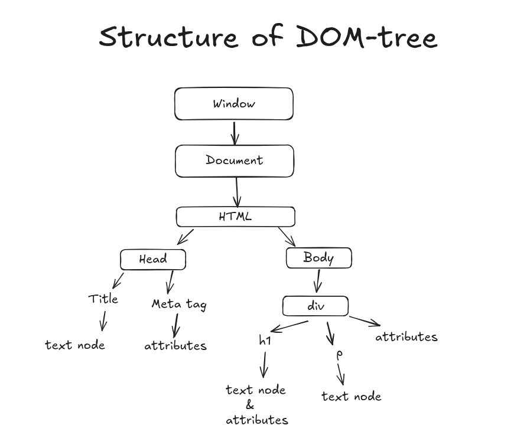

# Day 41 - Introduction to DOM
 
In the Day 41, I coverd the fundamentals of the DOM (Document Object Model) and how to manipulate it using JavaScript. How browsers represent HTML internally, what nodes are, and how to select element using `querySelector` and `getElementById`. 

---
## What is DOM?
- The Document Object Model (DOM) is a programming that the browser provides so JavaScript can interact with web pages.
- The DOM represents the structure of a document as a tree of nodes, where each node corresponds to an element, attribute, or piece of text in the HTML.
- The DOM allows developers to dynamically access and update the content, structure, and style of a web page.
---

### How the Browsers Represent HTML
- When a browser loads a web page:
  - It reads the HTML file.
  - It converts each TAG into a **object**.
  - These objects form a tree-like strucuture called the **DOM tree**.
- Each object in the DOM tree is called a **node**.

```html
<!DOCTYPE html>
<html lang="en">
<head>
    <meta charset="UTF-8">
    <meta name="viewport" content="width=device-width, initial-scale=1.0">
    <title>Introduction to DOM</title>
</head>
<body>
    <div class="bg-black">
        <h1 class="unique-heading">Introduction to DOM</h1>
        <p>The Document Object Model (DOM) is a programming interface for web documents.</p>
    </div>
</body>
</html>
```
> Visual Representation of the DOM Tree:



---
### The Document object
- `document` is an entry point to the DOM.
- In JS, the browser gives a global object called `document` that represents the entire HTML document.
```javascript
console.log(document);
```
- You can use the `document` object to access and manipulate elements on the web page.
- It can be used for:
    - Find elements
    - Change text or style
    - Add or remove elements
    - Listen to user events (clicks, key presses, etc.)
---
### Nodes in the DOM
- A **node** is any part of DOM-tree.
- Types of nodes:
   - Element nodes: tags like `<div>`, `<p>`, `<h1>`, etc.
   - Text nodes: The text inside the elements.
   - Attribute nodes: Attributes of elements like `class`, `id`, etc.
   - Comment nodes: Comments in the HTML code.
   - Document node: The entire document itself. 
---
## Selecting Elements in DOM
- You can select elements in DOM using various methods provided by the `document` object.

`html`
```html
<p id="message">Hello</p>
```
`js`
```javascript
const msg = document.getElementById('message');
console.log(msg); // <p id="message">Hello</p>
```
- supports:
    - `.class`
    - `#id`
    - `tag`
    - complex selectors like `div p`, `div > p`, etc.
---

## `getElementById` vs `querySelector`
- `getElementById`:
   - Selects a single element by its ID.
   - Returns the element directly.
   - Faster for selecting by ID.
```javascript
const elementById = document.getElementById('unique-heading');
console.log(elementById); // <h1 class="unique-heading">Introduction to DOM</
```
- `querySelector`:
   - Selects the first element that matches a CSS selector.
   - More versatile, can select by class, tag, attribute, etc.
   - Returns `null` if no match is found.
```javascript
const elementByQuery = document.querySelector('.unique-heading');
console.log(elementByQuery); // <h1 class="unique-heading">Introduction to DOM</h1>
```
---

# Summary
- The DOM is a programming interface for web documents that allows javascript to interact with HTML.
- Browsers represent HTML as a tree of nodes, where each node corresponds to an element,
- The `document` object is the entry point to the DOM.
- You can select elements using methods like `getElementById` and `querySelector`.
- `getElementById` is used for selecting elements by ID, while `querySelector` is more versatile and can select elements using any CSS selector.
- Both methods are essential for DOM manipulation and have their own use cases depending on the requirement.
---
