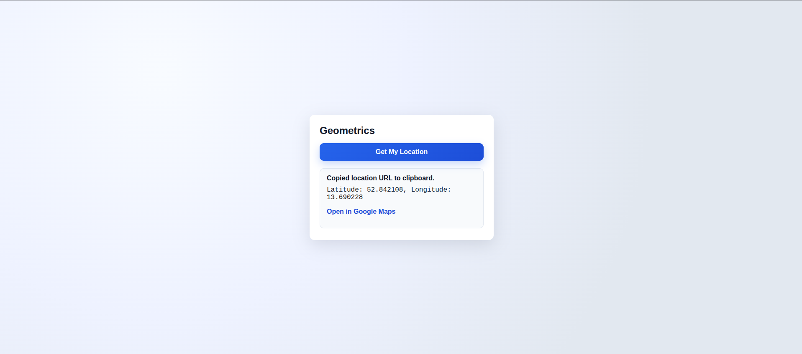

# Geometrics – Get My Location

A simple page that grabs your current geolocation, shows coordinates, links to Google Maps, and copies the map URL to your clipboard.

## Files
- `Geometrics.html` – markup and button
- `Geometrics.js` – geolocation + clipboard logic, output updates
- `Geometrics.css` – layout and styling

## Run locally
From this folder:
```bash
npx serve .
# then open http://localhost:5000/Geometrics.html
```

## How to use
1) Click **Get My Location**.
2) Allow the browser’s geolocation permission.
3) Coordinates will display; a Google Maps link appears.
4) The link URL is copied to your clipboard (if allowed). If copy fails, use the link shown.

---
### Image:

---

## Notes
- Geolocation and clipboard typically require HTTPS or `localhost`.
- If you deny permission, an error message is shown and the button re-enables.
- Clipboard copy may be blocked by browser settings; the link still works.
